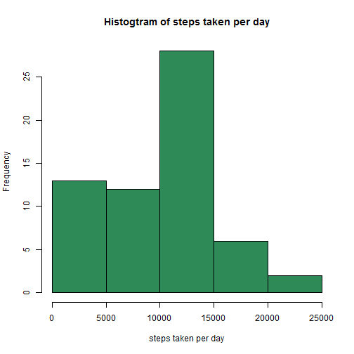
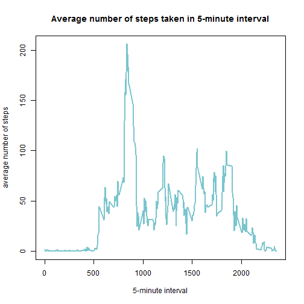
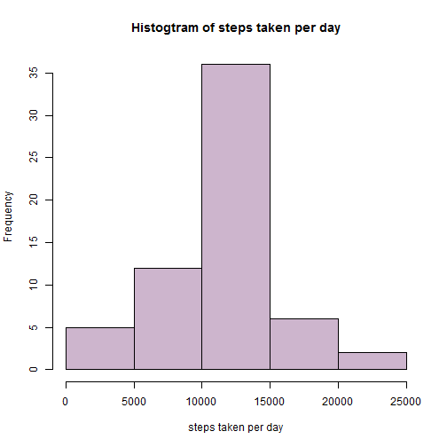
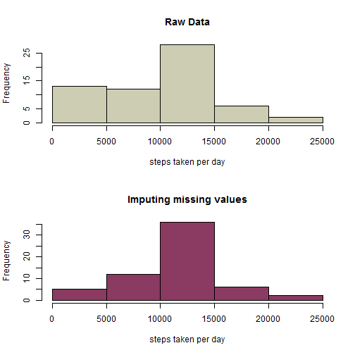
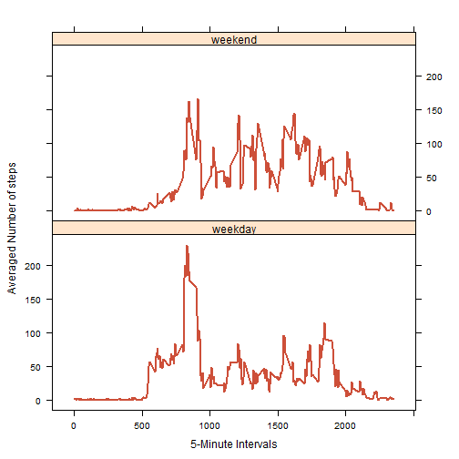

```r
options(encoding="utf8")
```

## Loading and preprocessing the data
Set Directory

```r
echo = TRUE
setwd(".")
```

Download Data

```r
echo = TRUE
library(data.table)

fileUrl <- "https://d396qusza40orc.cloudfront.net/repdata%2Fdata%2Factivity.zip"
download.file(url=fileUrl,destfile="repdata-2data-Factivity.zip")
unzip('repdata-2data-Factivity.zip', overwrite=TRUE)
```

Reading Data

```r
echo = TRUE
data <- read.csv("activity.csv", header=TRUE, sep=",", na.strings="NA")
```

Convert type of 'date' variable

```r
echo = TRUE
str(data)
```

```
## 'data.frame':	17568 obs. of  3 variables:
##  $ steps   : int  NA NA NA NA NA NA NA NA NA NA ...
##  $ date    : Factor w/ 61 levels "2012-10-01","2012-10-02",..: 1 1 1 1 1 1 1 1 1 1 ...
##  $ interval: int  0 5 10 15 20 25 30 35 40 45 ...
```

```r
data$date <- as.Date(data$date, "%Y-%m-%d")
str(data)
```

```
## 'data.frame':	17568 obs. of  3 variables:
##  $ steps   : int  NA NA NA NA NA NA NA NA NA NA ...
##  $ date    : Date, format: "2012-10-01" "2012-10-01" ...
##  $ interval: int  0 5 10 15 20 25 30 35 40 45 ...
```

```r
head(data)
```

```
##   steps       date interval
## 1    NA 2012-10-01        0
## 2    NA 2012-10-01        5
## 3    NA 2012-10-01       10
## 4    NA 2012-10-01       15
## 5    NA 2012-10-01       20
## 6    NA 2012-10-01       25
```

```r
tail(data)
```

```
##       steps       date interval
## 17563    NA 2012-11-30     2330
## 17564    NA 2012-11-30     2335
## 17565    NA 2012-11-30     2340
## 17566    NA 2012-11-30     2345
## 17567    NA 2012-11-30     2350
## 17568    NA 2012-11-30     2355
```

## Mean total number of steps taken per day
The total sum of steps for every single date

```r
echo = TRUE
library(dplyr)
sumTotal <- tapply(data$steps, data$date, FUN=sum, na.rm=T)
head(sumTotal)
```

```
## 2012-10-01 2012-10-02 2012-10-03 2012-10-04 2012-10-05 2012-10-06 
##          0        126      11352      12116      13294      15420
```

Histogram of the total number of steps taken each day

```r
echo = TRUE
hist(sumTotal, xlab="steps taken per day", main="Histogtram of steps taken per day", 
     col="seagreen")
```

 

The mean and median of the total number of steps taken per day

```r
echo = TRUE
valuesMeanMedian <- c(mean = round(mean(sumTotal)),median = round(median(sumTotal)))
print(valuesMeanMedian)
```

```
##   mean median 
##   9354  10395
```

## The average daily activity

```r
echo = TRUE
mn_int <- tapply(data$steps, data$interval, mean, na.rm=T)
plot(mn_int ~ unique(data$interval), type="l", xlab = "5-minute interval", 
     ylab="average number of steps", 
     main="Average number of steps taken in 5-minute interval",
     col="cadetblue3", lwd=2)
```

 


5-minute interval, contains the maximum number of steps

```r
echo = TRUE
max(mn_int, na.rm=T)
```

```
## [1] 206.1698
```

## Imputing missing values
The total number of missing values in the dataset

```r
echo = TRUE
sum(is.na(data))
```

```
## [1] 2304
```

Creation a new dataset that is equal to the original dataset but with the missing data filled in
Development a strategy for filling in all of the missing values in the dataset

```r
echo = TRUE
data2 <- data 

for(i in 1:nrow(data)){
    if(is.na(data$steps[i])){
        data2$steps[i] <- as.integer(mn_int[[as.character(data[i, "interval"])]])
    }
}
```

The total number of missing values in a new dataset

```r
echo = TRUE
sum(is.na(data2))
```

```
## [1] 0
```

Histogram of the total number of steps taken each day in a new dataset

```r
echo = TRUE
sumTotal2 <- tapply(data2$steps, data2$date, sum, na.rm=T)
hist(sumTotal2, xlab="steps taken per day", main="Histogtram of steps taken per day", 
     col="thistle3")
```

 

Print two histogram with missing and without missing values

```r
echo = TRUE
par(mfrow = c(2, 1))
hist(sumTotal, xlab="steps taken per day", main="Raw Data",col="lightyellow3")
hist(sumTotal2, xlab="steps taken per day", main="Imputing missing values",col="hotpink4")
```

 

```r
dev.off()
```

```
## RStudioGD 
##         2
```

The mean and median of the total number of steps taken per day in a new dataset

```r
echo = TRUE
valuesMeanMedian2 <- c(mean = round(mean(sumTotal2)),median = round(median(sumTotal2)))
print(valuesMeanMedian2)
```

```
##   mean median 
##  10750  10641
```
#### Make a histogram of the total number of steps taken each day and Calculate and report the mean and median total number of steps taken per day. Do these values differ from the estimates from the first part of the assignment? What is the impact of imputing missing data on the estimates of the total daily number of steps?

They show differences in the median and in the histograms. Based on the method used for filling in missing values, we can get different mean and median values. The histogram can also be different based on the strategy we used to fill in the missing values, but not much, as with the row data mean = 9354 median = 10395 and with the filled-in missing values mean=10750 median=10641

## Weekdays and weekends
### Creation a new factor variable in the dataset with two levels - 'weekday' and 'weekend' indicating whether a given date is a weekday or weekend day

```r
echo = TRUE
data2$date <- as.Date(data2$date)
data2$weekdays <- factor(format(data2$date, "%A"))
```


## Making a panel plot containing a time series plot

```r
echo = TRUE
levels(data2$weekdays) <- list(weekday = c("понедельник","вторник","среда","четверг","пятница"),
                                  weekend = c("суббота","воскресенье"))
# "понедельник","вторник","среда","четверг","пятница" - "monday","tuesday","wednesday","thursday","friday"
# "суббота", "воскресенье" - "saturday","sunday"
#head(data2)

library(lattice)
meanALL <- aggregate(steps ~ interval + weekdays, data=data2, mean)
xyplot(meanALL$steps ~ meanALL$interval | meanALL$weekdays, type = "l", 
       xlab = "5-Minute Intervals", ylab = "Averaged Number of steps",
       layout = c(1, 2),col="tomato3",lwd=2
       )
```

 


